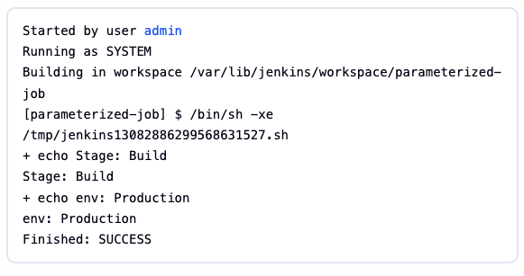

# Day 72: Jenkins Parameterized Builds

A new DevOps Engineer has joined the team and he will be assigned some Jenkins related tasks. Before that, the team wanted to test a simple parameterized job to understand basic functionality of parameterized builds. He is given a simple parameterized job to build in Jenkins. Please find more details below:

Click on the `Jenkins` button on the top bar to access the Jenkins UI. Login using username `admin` and password `[redacted]`.

## Specific Requirements:

1. Create a `parameterized` job which should be named as `parameterized-job`

2. Add a `string` parameter named `Stage`; its default value should be `Build`.

3. Add a `choice` parameter named `env`; its choices should be `Development`, `Staging` and `Production`.

4. Configure job to execute a shell command, which should echo both parameter values (you are passing in the job).

5. Build the Jenkins job at least once with choice parameter value `Production` to make sure it passes.

`Note:`

1. You might need to install some plugins and restart Jenkins service. So, we recommend clicking on `Restart Jenkins when installation is complete and no jobs are running` on plugin installation/update page i.e `update centre`. Also, Jenkins UI sometimes gets stuck when Jenkins service restarts in the back end. In this case, please make sure to refresh the UI page.

2. For these kind of scenarios requiring changes to be done in a web UI, please take screenshots so that you can share it with us for review in case your task is marked incomplete. You may also consider using a screen recording software such as loom.com to record and share your work.

> **Credential note:** The temporary lab password in the original challenge is redacted from this public guide. Enter the value shown in your active KodeKloud task.

## Solution

A parameterized Jenkins job accepts values when a build starts. For this challenge, a Freestyle project's **Execute shell** step receives the `Stage` and `env` parameters as environment variables and prints their selected values.

### 🔐 Step 1: Sign In and Create the Job

1. Click **Jenkins** in the lab's top bar and sign in as `admin` using the password from the current lab prompt.
2. Select **New Item**.
3. Enter `parameterized-job`, choose **Freestyle project**, and select **OK**.

> **Why:** A Jenkins project, also called a job, defines the work that runs during a build. A Freestyle project provides the parameter controls and shell build step needed for this simple test without requiring a Pipeline script.

### 🧩 Step 2: Add the Parameters

1. Under **General**, enable **This project is parameterized**.
2. Select **Add Parameter → String Parameter**. Set **Name** to `Stage` and **Default Value** to `Build`.
3. Select **Add Parameter → Choice Parameter**. Set **Name** to `env` and enter these values in **Choices**, one per line:

   ```text
   Development
   Staging
   Production
   ```

> **Why:** A string parameter allows editable text; its default supplies `Build` if the user does not change it. A choice parameter limits `env` to the listed environments. Parameter names are case-sensitive: the shell will later read `$Stage` with an uppercase `S` and `$env` in lowercase. Jenkins supplies Freestyle build parameters to shell steps as environment variables.

### 🛠️ Step 3: Print the Values in a Shell Build Step

Under **Build Steps**, select **Add build step → Execute shell** and enter:

```sh
echo "Stage: $Stage"
echo "env: $env"
```

Select **Save**.

> **Why:** `echo` writes text to the build's console output. The shell expands `$Stage` and `$env` to the values selected for that particular build, so the output shows what Jenkins actually passed to the job. The quotes preserve the text as one argument if a parameter value contains spaces.

### ✅ Step 4: Verify

1. Select **Build with Parameters** on `parameterized-job`.
2. Leave `Stage` as `Build`, choose `Production` for `env`, and start the build.
3. Open the build from **Build History**, then select **Console Output**. Confirm it includes:

   ```text
   Stage: Build
   env: Production
   Finished: SUCCESS
   ```

The following screenshot captures the successful build's console output:



> **Why:** The two printed lines confirm that both selected parameter values reached the shell step. `Finished: SUCCESS` confirms the job completed. This screenshot proves the build output; use separate configuration screenshots if you need to show the parameter types, default, and available choices for review. The lab was marked successful after this build.

## Best Practices

- **Match parameter names exactly.** `Stage` and `env` use different capitalization; the shell references must match the names configured in Jenkins.
- **Use a choice for known environments.** Restricting `env` to three options prevents accidental spelling differences when launching builds.
- **Keep build evidence scoped.** The console screenshot shows the selected values and successful result, while configuration screenshots are needed to demonstrate how the job was defined.
- **Do not publish lab credentials.** Keep the temporary Jenkins password out of the repository and screenshots.

### 📚 Official Documentation

- [Jenkins: Working with projects](https://www.jenkins.io/doc/book/using/working-with-projects/)
- [Jenkins: Handling environment variables](https://www.jenkins.io/doc/book/security/environment-variables/)
- [Jenkins: Managing plugins](https://www.jenkins.io/doc/book/managing/plugins/)
